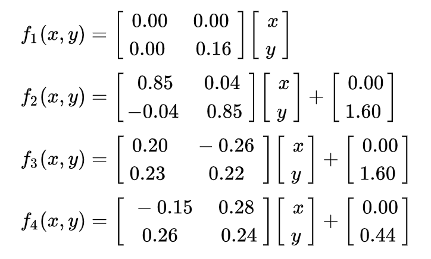

# Barnsley Fern

### Barnsley Fern generation visualization

Link to hosted project: [Barnsley Fern](https://tansonlee.github.io/barnsley-fern/)

Made with JavaScript and visualized with the p5.js library

This fractal is generated using the transformation of a point which starts at (0, 0). One of the four transformations are chosen at a specific probability. These transformations are:

 
 

Source:  
https://en.wikipedia.org/wiki/Barnsley_fern
